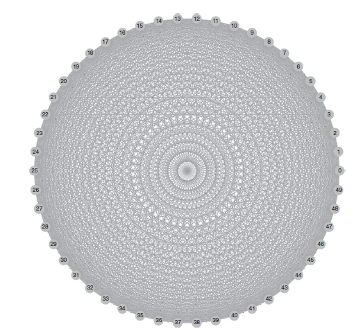
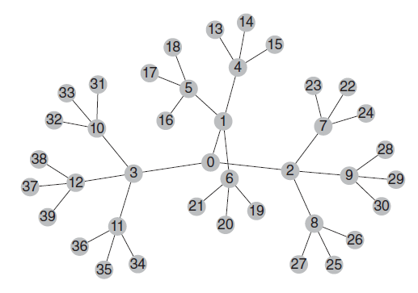

# Introduction

This is the implementation for Hierarchical Risk Parity approach to portfolio optimization
as introduced by [Machine Learning Asset Allocation](Machine Learning Asset Allocation.pdf).

# What is in the Jupyter Notebook?

In the notebook, we will calculate optimal portfolio `['AAPL', 'PETS', 'STMP', 'VZ', 'SO', 'T', 'FXY', 'FXB', 'FXF', 'VCLT']`. They are selected randomly.

>`pricing.csv` contains the price history of the tickers above from 2015 to 2020.

Required Modules to run
> `numpy-1.17.4`\
> `pandas-0.24.0`\
> `scipy-1.3.3` \
> `matplotlib-3.1.2`

## How Does it Work?

### The Problem With Markwoitz's Optimization Method
>**The more correlated the investments, the greater the need for diversification, and yet the more likely we will receive unstable solutions.** The benefits of diversification often are more than offset by estimation errors.

### From Geometric to Hierarchical Relationships

> Suppose that an investor wishes to build a diversified portfolio of securities, including hundreds of stocks, bonds and hedge fund, real estate, private placemnets and etc. Some investments seem closer substitutes for one another, and ohter investments seem complementary to one another. 

> Yet, to a correlation matrix all investments are potential substitutes to one another. In other words correlation matrices lack the notion of hierarchy.  THis lack of hierarchical structure allowes weights to vary freely in unintended ways, which is a root cause of Critical Line Algorithm (CLA)'s instability. 

> A tree structure introduces 2 desirable features: 
>1. It has only N-a edges to connect N nodes, so the weights only reblances among peers are various hierarchical levels.
>2. The weights are distributed top-down, consistent with how many asset managers build their portfolios, such as from asset class to sectors to individual securities.

We can think of covariance matrix as a fully connected graph, meaning every node is connected with every other node. Each edge representing the covariance/corelation. Just like what this graph from the book.

But the author is saying that this full tree has no hierarchy, but in really portfolio allocation, hierarchy is needed. For example, if I am aollocating in financials, consumer staples and tech, each of these sectors have some correlations, equties within those sectors have correlations among themselves.

So, the author is proposing a hierarchical tree structure instead of a matrix.

The Hierarchical Risk Parity method uses the information contained in the covariance matrix without requiring its inversion or positive-definitiveness. The algorithm operates in 2 stages 1) tree clustering 2) qusai-diagonalization, 3) recursive bisection.

